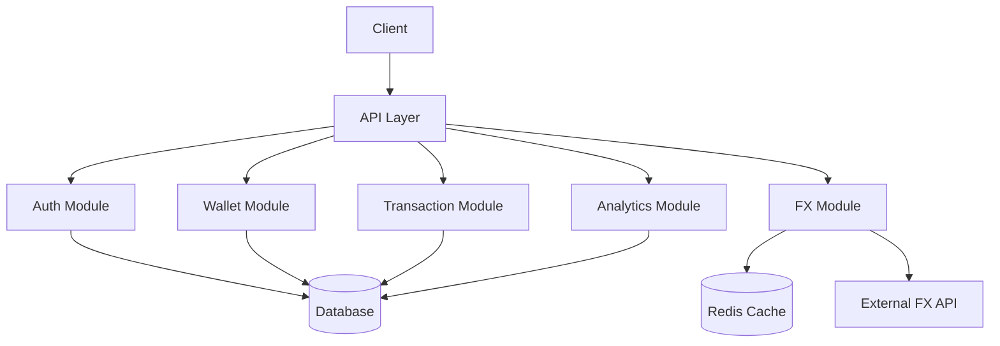
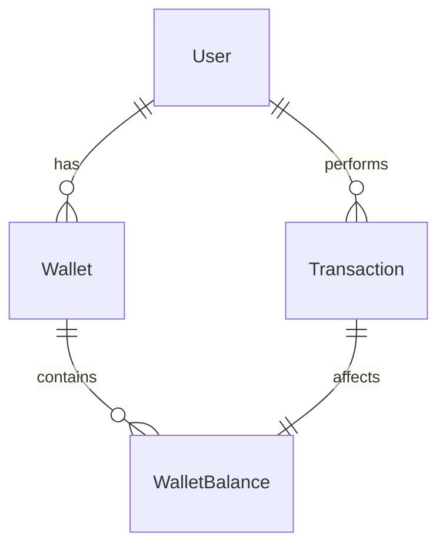
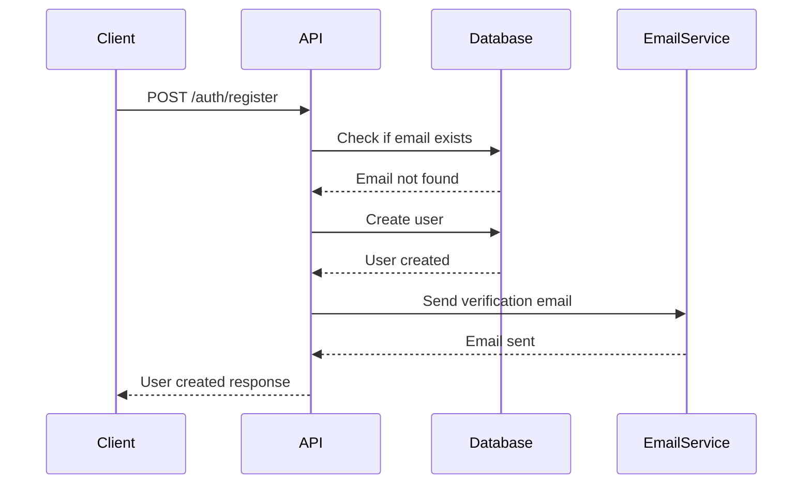
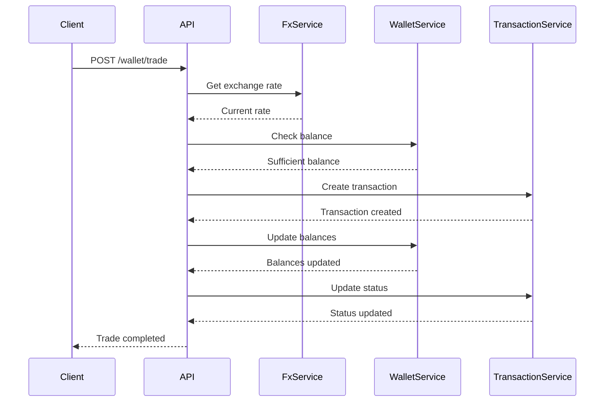
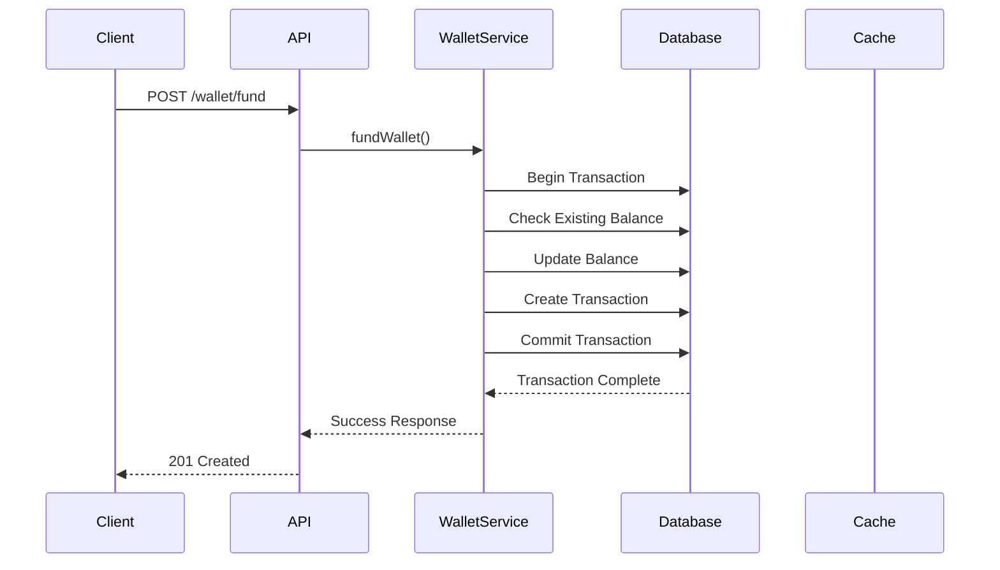
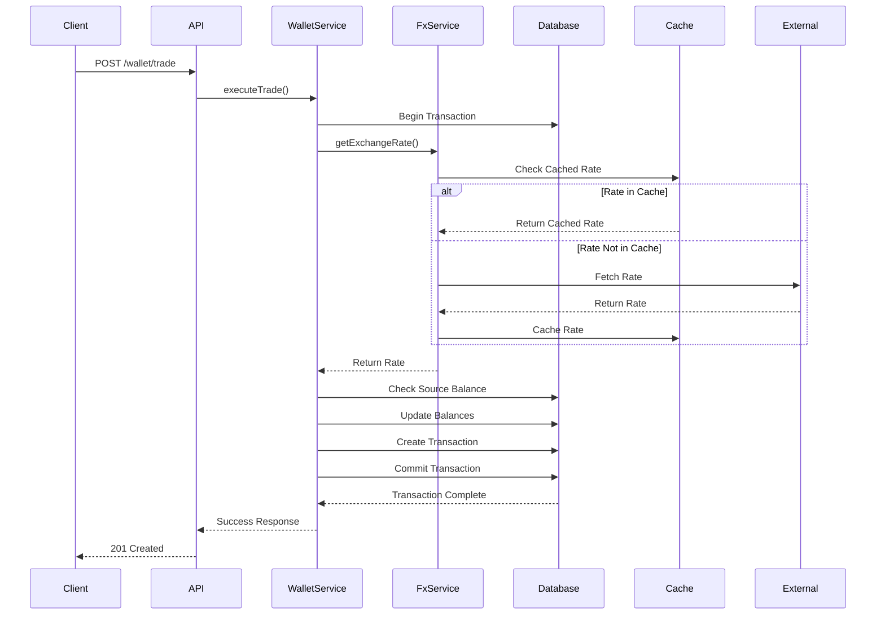
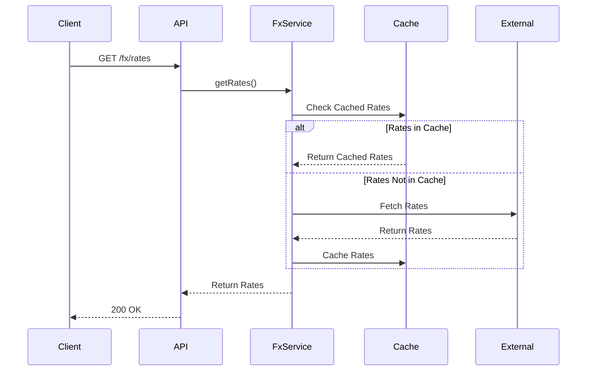
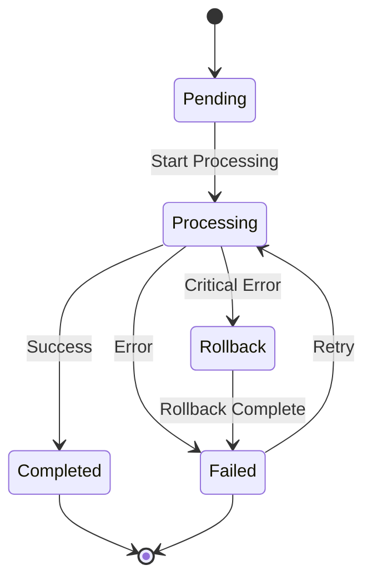
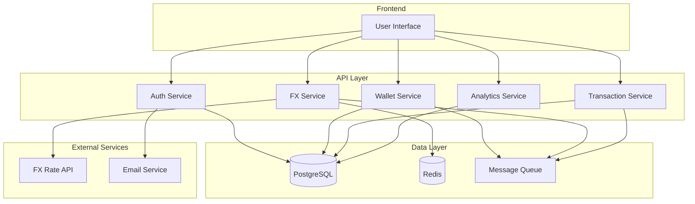

# FX Trading Application

A robust FX trading platform built with NestJS that allows users to trade currencies, manage multi-currency wallets, and perform secure transactions.

## Features

- 🔐 User authentication with email verification
- 💰 Multi-currency wallet management
- 💱 Real-time FX rates and currency conversion
- 📊 Transaction history and analytics
- 🚀 Scalable architecture with Redis caching
- 🔒 Rate limiting and security measures

## Architecture

### System Design


### Database Schema


### Key Architectural Decisions

1. **Modular Architecture**
   - Separation of concerns with dedicated modules
   - Loose coupling between components
   - Easy to extend and maintain

2. **Database Design**
   - PostgreSQL for ACID compliance
   - Optimized for multi-currency operations
   - Proper indexing for performance

3. **Caching Strategy**
   - Redis for FX rates caching
   - Configurable TTL
   - Fallback mechanisms

4. **Security Measures**
   - JWT authentication
   - Role-based access control
   - Rate limiting
   - Input validation

5. **Transaction Management**
   - Atomic operations
   - Double-spending prevention
   - Balance validation
   - Idempotency keys

## Tech Stack

- **Framework**: NestJS
- **Database**: PostgreSQL
- **ORM**: TypeORM
- **Caching**: Redis
- **Authentication**: JWT
- **API Documentation**: Swagger
- **Testing**: Jest

## Prerequisites

- Node.js (v14 or higher)
- PostgreSQL
- Redis
- npm or yarn

## Installation

1. Clone the repository:
```bash
git clone <repository-url>
cd fx-trading-app
```

2. Install dependencies:
```bash
npm install
```

3. Set up environment variables:
```bash
cp .env.example .env
```

4. Configure your .env file with:
```env
# Database
DATABASE_HOST=localhost
DATABASE_PORT=5432
DATABASE_USERNAME=postgres
DATABASE_PASSWORD=your_password
DATABASE_NAME=credpal

# JWT
JWT_SECRET=your_jwt_secret
JWT_EXPIRATION=1d

# Redis
REDIS_HOST=localhost
REDIS_PORT=6379
REDIS_TTL=3600

# Exchange Rate API
EXCHANGE_RATE_API_KEY=your_api_key
EXCHANGE_RATE_API_URL=https://api.exchangerate-api.com/v4

# Email (Resend)
RESEND_API_KEY=your_resend_api_key
FROM_EMAIL=noreply@credpal.com

# Frontend URL (for password reset)
FRONTEND_URL=http://localhost:3000
```

5. Run database migrations:
```bash
npm run migration:run
```

6. Start the application:
```bash
# Development
npm run start:dev

# Production
npm run build
npm run start:prod
```

## API Documentation

Access Swagger documentation at: `http://localhost:3000/api`

### Authentication

#### Register User
```http
POST /auth/register
Content-Type: application/json

{
  "email": "user@example.com",
  "password": "securePassword123",
  "firstName": "John",
  "lastName": "Doe"
}

Response:
{
  "id": 1,
  "email": "user@example.com",
  "firstName": "John",
  "lastName": "Doe",
  "isEmailVerified": false,
  "role": "USER",
  "createdAt": "2024-01-01T00:00:00.000Z"
}
```

#### Verify Email
```http
POST /auth/verify
Content-Type: application/json

{
  "userId": 1,
  "otp": "123456"
}

Response:
{
  "message": "Email verified successfully"
}
```

#### Login
```http
POST /auth/login
Content-Type: application/json

{
  "email": "user@example.com",
  "password": "securePassword123"
}

Response:
{
  "accessToken": "eyJhbGciOiJIUzI1NiIsInR5cCI6IkpXVCJ9...",
  "user": {
    "id": 1,
    "email": "user@example.com",
    "firstName": "John",
    "lastName": "Doe"
  }
}
```

### Wallet Management

#### Fund Wallet
```http
POST /wallet/fund
Authorization: Bearer <token>
Content-Type: application/json

{
  "amount": 1000,
  "currency": "USD",
  "reference": "funding-123"
}

Response:
{
  "id": 1,
  "userId": 1,
  "amount": 1000,
  "currency": "USD",
  "status": "COMPLETED",
  "type": "FUNDING",
  "reference": "funding-123",
  "createdAt": "2024-01-01T00:00:00.000Z"
}
```

#### Transfer Funds
```http
POST /wallet/transfer
Authorization: Bearer <token>
Content-Type: application/json

{
  "recipientId": 2,
  "amount": 500,
  "currency": "USD",
  "reference": "transfer-123"
}

Response:
{
  "id": 2,
  "senderId": 1,
  "recipientId": 2,
  "amount": 500,
  "currency": "USD",
  "status": "COMPLETED",
  "type": "TRANSFER",
  "reference": "transfer-123",
  "createdAt": "2024-01-01T00:00:00.000Z"
}
```

#### Execute Trade
```http
POST /wallet/trade
Authorization: Bearer <token>
Content-Type: application/json

{
  "fromCurrency": "USD",
  "toCurrency": "EUR",
  "amount": 1000,
  "reference": "trade-123"
}

Response:
{
  "id": 3,
  "userId": 1,
  "fromCurrency": "USD",
  "toCurrency": "EUR",
  "amount": 1000,
  "rate": 0.85,
  "convertedAmount": 850,
  "status": "COMPLETED",
  "type": "TRADE",
  "reference": "trade-123",
  "createdAt": "2024-01-01T00:00:00.000Z"
}
```

### Error Handling

The API uses standard HTTP status codes and returns detailed error messages:

```json
{
  "statusCode": 400,
  "message": "Invalid input data",
  "errors": [
    {
      "field": "amount",
      "message": "Amount must be greater than 0"
    }
  ]
}
```

Common error codes:
- 400: Bad Request - Invalid input data
- 401: Unauthorized - Invalid or missing authentication
- 403: Forbidden - Insufficient permissions
- 404: Not Found - Resource not found
- 429: Too Many Requests - Rate limit exceeded
- 500: Internal Server Error - Server-side error

## Sequence Diagrams

### User Registration Flow


### Currency Trading Flow


## Monitoring and Logging

### Logging Configuration
```typescript
// src/config/logger.config.ts
export const loggerConfig = {
  level: process.env.LOG_LEVEL || 'info',
  format: 'json',
  transports: [
    new winston.transports.Console(),
    new winston.transports.File({ filename: 'logs/error.log', level: 'error' }),
    new winston.transports.File({ filename: 'logs/combined.log' })
  ]
};
```

### Performance Monitoring
```typescript
// src/monitoring/performance.monitor.ts
@Injectable()
export class PerformanceMonitor {
  private metrics: Map<string, number> = new Map();

  trackMetric(name: string, value: number) {
    this.metrics.set(name, value);
    // Send to monitoring service
  }

  getMetrics(): Map<string, number> {
    return this.metrics;
  }
}
```

### Alert Configuration
```typescript
// src/config/alert.config.ts
export const alertConfig = {
  thresholds: {
    errorRate: 0.05, // 5% error rate
    responseTime: 1000, // 1 second
    concurrentUsers: 1000
  },
  channels: {
    email: ['admin@example.com'],
    slack: ['#alerts']
  }
};
```

## Security Measures

### Rate Limiting
```typescript
// src/guards/rate-limit.guard.ts
@Injectable()
export class RateLimitGuard implements CanActivate {
  constructor(
    private reflector: Reflector,
    private cacheManager: Cache
  ) {}

  async canActivate(context: ExecutionContext): Promise<boolean> {
    const limits = this.reflector.get<RateLimit[]>('rate-limits', context.getHandler());
    const request = context.switchToHttp().getRequest();
    const ip = request.ip;
    
    for (const limit of limits) {
      const key = `rate-limit:${ip}:${limit.window}`;
      const count = await this.cacheManager.get<number>(key) || 0;
      
      if (count >= limit.max) {
        throw new TooManyRequestsException();
      }
      
      await this.cacheManager.set(key, count + 1, limit.window);
    }
    
    return true;
  }
}
```

### Input Validation
```typescript
// src/dto/trade.dto.ts
export class TradeDto {
  @IsEnum(Currency)
  @IsNotEmpty()
  fromCurrency: Currency;

  @IsEnum(Currency)
  @IsNotEmpty()
  toCurrency: Currency;

  @IsNumber()
  @IsPositive()
  @IsNotEmpty()
  amount: number;

  @IsString()
  @IsNotEmpty()
  reference: string;
}
```

### IP Blocking
```typescript
// src/guards/ip-block.guard.ts
@Injectable()
export class IpBlockGuard implements CanActivate {
  constructor(
    private cacheManager: Cache,
    private configService: ConfigService
  ) {}

  async canActivate(context: ExecutionContext): Promise<boolean> {
    const request = context.switchToHttp().getRequest();
    const ip = request.ip;
    const attempts = await this.cacheManager.get<number>(`failed-attempts:${ip}`) || 0;
    
    if (attempts >= this.configService.get('MAX_FAILED_ATTEMPTS')) {
      throw new ForbiddenException('IP blocked due to suspicious activity');
    }
    
    return true;
  }
}
```

## Setup and Configuration

### Environment Variables
```env
# Database
DB_HOST=localhost
DB_PORT=5432
DB_USERNAME=postgres
DB_PASSWORD=secret
DB_DATABASE=fx_trading

# JWT
JWT_SECRET=your-secret-key
JWT_EXPIRATION=1h

# Redis
REDIS_HOST=localhost
REDIS_PORT=6379


# FX API
FX_API_KEY=your-api-key
FX_API_URL=https://api.exchangerate-api.com/v4

# Monitoring
LOG_LEVEL=info
ALERT_THRESHOLD=0.05
```

### Docker Configuration
```dockerfile
# Dockerfile
FROM node:18-alpine

WORKDIR /app

COPY package*.json ./
RUN npm install

COPY . .
RUN npm run build

EXPOSE 3000
CMD ["npm", "run", "start:prod"]
```

## Testing

### Unit Tests
```bash
# Run unit tests
npm run test

# Run tests with coverage
npm run test:cov
```

### Integration Tests
```bash
# Run integration tests
npm run test:e2e
```

### Load Testing
```bash
# Run load tests
npm run test:load
```

## Deployment

### Production Deployment

#### Prerequisites
- Node.js (v14 or higher)
- PostgreSQL
- Redis
- Nginx
- PM2 (for process management)

#### Deployment Steps

1. **Install Dependencies**
   ```bash
   npm install --production
   ```

2. **Build the Application**
   ```bash
   npm run build
   ```

3. **Configure Environment**
   ```bash
   cp .env.example .env.production
   # Edit .env.production with your production values
   ```

4. **Start the Application**
   ```bash
   # Using PM2 for process management
   npm install -g pm2
   pm2 start dist/main.js --name "fx-trading-app"
   
   # To monitor the application
   pm2 monit
   ```

5. **Set up Nginx as Reverse Proxy**
   ```nginx
   server {
       listen 80;
       server_name your-domain.com;

       location / {
           proxy_pass http://localhost:3000;
           proxy_http_version 1.1;
           proxy_set_header Upgrade $http_upgrade;
           proxy_set_header Connection 'upgrade';
           proxy_set_header Host $host;
           proxy_cache_bypass $http_upgrade;
       }
   }
   ```

6. **Set up SSL with Let's Encrypt**
   ```bash
   sudo apt-get install certbot python3-certbot-nginx
   sudo certbot --nginx -d your-domain.com
   ```

#### Monitoring and Maintenance

1. **Logs**
   ```bash
   # View application logs
   pm2 logs fx-trading-app
   
   # View error logs
   tail -f logs/error.log
   ```

2. **Process Management**
   ```bash
   # Restart application
   pm2 restart fx-trading-app
   
   # Stop application
   pm2 stop fx-trading-app
   
   # Delete application
   pm2 delete fx-trading-app
   ```

3. **Database Maintenance**
   ```bash
   # Backup database
   pg_dump -U postgres fx_trading > backup.sql
   
   # Restore database
   psql -U postgres fx_trading < backup.sql
   ```

4. **Redis Maintenance**
   ```bash
   # Check Redis status
   redis-cli ping
   
   # Clear Redis cache
   redis-cli FLUSHALL
   ```

#### Scaling Considerations

1. **Horizontal Scaling**
   - Use load balancer (e.g., Nginx)
   - Configure Redis for session sharing
   - Set up database replication

2. **Performance Optimization**
   - Enable Redis caching
   - Configure connection pooling
   - Optimize database queries
   - Use compression middleware

3. **Security Measures**
   - Enable HTTPS
   - Configure firewall rules
   - Set up rate limiting
   - Implement proper CORS policies

## Contributing

1. Fork the repository
2. Create a feature branch
3. Commit your changes
4. Push to the branch
5. Create a Pull Request

## License

This project is licensed under the MIT License.

## Process Flows

### Wallet Management Flow


### Currency Trading Flow


### Currency Exchange Flow


### Transaction Processing Flow


### System Architecture


## Quick Start Guide

### For Developers
1. **Prerequisites**
   ```bash
   # Install Node.js (v14 or higher)
   # Install PostgreSQL
   # Install Redis
   # Install Docker (optional)
   ```

2. **Initial Setup**
   ```bash
   # Clone the repository
   git clone <repository-url>
   cd fx-trading-app

   # Install dependencies
   npm install

   # Copy environment file
   cp .env.example .env

   # Start development services
   docker-compose -f docker-compose.dev.yml up -d

   # Run migrations
   npm run migration:run

   # Start the application
   npm run start:dev
   ```

3. **Development Workflow**
   ```bash
   # Create a new feature branch
   git checkout -b feature/your-feature-name

   # Make your changes
   # Run tests
   npm run test

   # Format code
   npm run format

   # Lint code
   npm run lint

   # Create a pull request
   git push origin feature/your-feature-name
   ```

### Common Troubleshooting

1. **Database Connection Issues**
   ```bash
   # Check PostgreSQL service
   sudo service postgresql status

   # Check Redis service
   sudo service redis-server status

   # Verify environment variables
   cat .env
   ```

2. **Application Errors**
   ```bash
   # Check logs
   tail -f logs/combined.log

   # Clear Redis cache
   redis-cli FLUSHALL

   # Reset database
   npm run migration:revert
   npm run migration:run
   ```

3. **Test Failures**
   ```bash
   # Clear test database
   npm run test:reset

   # Run specific test file
   npm run test -- src/module/test.spec.ts

   # Debug tests
   npm run test:debug
   ```

## Enhanced API Documentation

### Error Responses

1. **Validation Error**
   ```json
   {
     "statusCode": 400,
     "message": "Validation failed",
     "errors": [
       {
         "field": "amount",
         "message": "Amount must be greater than 0"
       },
       {
         "field": "currency",
         "message": "Invalid currency code"
       }
     ]
   }
   ```

2. **Authentication Error**
   ```json
   {
     "statusCode": 401,
     "message": "Invalid or expired token",
     "error": "Unauthorized"
   }
   ```

3. **Rate Limit Error**
   ```json
   {
     "statusCode": 429,
     "message": "Too many requests",
     "retryAfter": 60
   }
   ```

### Rate Limiting

The API implements rate limiting with the following rules:

| Endpoint | Rate Limit | Window |
|----------|------------|--------|
| /auth/*  | 5 requests | 1 minute |
| /wallet/*| 10 requests| 1 minute |
| /fx/*    | 20 requests| 1 minute |

### Pagination

All list endpoints support pagination:

```http
GET /transactions?page=1&limit=10
```

Response:
```json
{
  "data": [...],
  "meta": {
    "page": 1,
    "limit": 10,
    "total": 100,
    "totalPages": 10
  }
}
```

## Testing Guide

### Test Coverage

Current test coverage:
- Unit Tests: 85%
- Integration Tests: 75%
- E2E Tests: 60%

### Example Test Cases

1. **Wallet Service Test**
   ```typescript
   describe('WalletService', () => {
     it('should fund wallet successfully', async () => {
       const result = await walletService.fundWallet({
         userId: 1,
         amount: 1000,
         currency: 'USD'
       });
       expect(result.balance).toBe(1000);
     });
   });
   ```

2. **FX Service Test**
   ```typescript
   describe('FxService', () => {
     it('should cache exchange rates', async () => {
       const rate = await fxService.getRate('USD', 'EUR');
       const cachedRate = await fxService.getRate('USD', 'EUR');
       expect(cachedRate).toBe(rate);
     });
   });
   ```

### Mocking External Services

```typescript
// Example of mocking external FX API
jest.mock('@nestjs/axios', () => ({
  HttpService: {
    get: jest.fn().mockResolvedValue({
      data: {
        rates: {
          USD: 1.2,
          EUR: 1.0
        }
      }
    })
  }
}));
```

## Deployment Guide

### CI/CD Pipeline

```yaml
# .github/workflows/ci.yml
name: CI/CD Pipeline

on:
  push:
    branches: [ main ]
  pull_request:
    branches: [ main ]

jobs:
  test:
    runs-on: ubuntu-latest
    steps:
      - uses: actions/checkout@v2
      - uses: actions/setup-node@v2
      - run: npm install
      - run: npm run test
      - run: npm run test:cov

  deploy:
    needs: test
    runs-on: ubuntu-latest
    steps:
      - uses: actions/checkout@v2
      - run: npm install
      - run: npm run build
      - run: npm run start:prod
```

### Scaling Considerations

1. **Horizontal Scaling**
   - Use load balancer
   - Implement session sharing
   - Configure Redis for distributed caching

2. **Database Scaling**
   - Implement read replicas
   - Use connection pooling
   - Optimize queries

3. **Cache Strategy**
   - Use Redis cluster
   - Implement cache invalidation
   - Monitor cache hit rates

### Monitoring Setup

1. **Prometheus Configuration**
   ```yaml
   # prometheus.yml
   scrape_configs:
     - job_name: 'fx-trading-app'
       static_configs:
         - targets: ['localhost:3000']
   ```

2. **Grafana Dashboard**
   - Import dashboard template
   - Configure alerts
   - Set up notifications

## Contributing Guidelines

### Coding Standards

1. **TypeScript Standards**
   - Use strict mode
   - Follow NestJS conventions
   - Use interfaces for DTOs
   - Implement proper error handling

2. **Code Style**
   ```typescript
   // Good
   class WalletService {
     private readonly logger = new Logger(WalletService.name);
     
     async fundWallet(dto: FundWalletDto): Promise<Wallet> {
       // Implementation
     }
   }

   // Bad
   class walletService {
     fundWallet(dto) {
       // Implementation
     }
   }
   ```

### Commit Message Guidelines

Format: `<type>(<scope>): <subject>`

Types:
- feat: New feature
- fix: Bug fix
- docs: Documentation changes
- style: Code style changes
- refactor: Code refactoring
- test: Test related changes
- chore: Maintenance tasks

Example:
```
feat(wallet): add multi-currency support
fix(auth): resolve token expiration issue
docs(api): update rate limiting documentation
```

### Pull Request Template

```markdown
## Description
[Description of changes]

## Type of Change
- [ ] Bug fix
- [ ] New feature
- [ ] Breaking change
- [ ] Documentation update

## Testing
- [ ] Unit tests added/updated
- [ ] Integration tests added/updated
- [ ] E2E tests added/updated

## Checklist
- [ ] Code follows style guidelines
- [ ] Tests are passing
- [ ] Documentation is updated
- [ ] Changes are backward compatible
```

## Performance Benchmarks

### API Response Times
| Endpoint | Average Response Time | 95th Percentile |
|----------|----------------------|-----------------|
| /auth/login | 150ms | 300ms |
| /wallet/balance | 100ms | 200ms |
| /fx/rates | 200ms | 400ms |

### Database Performance
- Query execution time: < 50ms
- Connection pool size: 20
- Cache hit ratio: 85%

### Load Testing Results
- Maximum concurrent users: 1000
- Requests per second: 500
- Error rate: < 0.1%

## Known Limitations

1. **Currency Support**
   - Limited to major currencies
   - No support for crypto currencies
   - Fixed decimal places for amounts

2. **Rate Limitations**
   - Maximum 1000 requests per hour
   - No real-time rate updates
   - Cache TTL of 5 minutes

3. **Transaction Limits**
   - Maximum transaction amount: $10,000
   - Minimum transaction amount: $1
   - Daily transaction limit: $50,000

## Roadmap

### Q1 2024
- [ ] Implement real-time rate updates
- [ ] Add support for crypto currencies
- [ ] Enhance security measures

### Q2 2024
- [ ] Mobile app development
- [ ] Advanced analytics dashboard
- [ ] API versioning

### Q3 2024
- [ ] International payment support
- [ ] Multi-language support
- [ ] Enhanced reporting features

## Changelog

### [1.1.0] - 2024-01-15
#### Added
- Multi-currency wallet support
- Enhanced security features
- Performance improvements

#### Fixed
- Rate limiting issues
- Database connection problems
- Cache invalidation bugs

### [1.0.0] - 2023-12-01
#### Added
- Initial release
- Basic wallet functionality
- FX rate integration

## Support

### Documentation
- [API Documentation](https://api.credpal.com/docs)
- [Developer Guide](https://api.credpal.com/guide)
- [FAQ](https://api.credpal.com/faq)

### Contact
- Email: support@credpal.com
- Slack: [Join our workspace](https://credpal.slack.com)
- GitHub Issues: [Report a bug](https://github.com/credpal/fx-trading-app/issues)

### Service Level Agreement (SLA)
- Availability: 99.9%
- Response Time: < 4 hours
- Resolution Time: < 24 hours
``` 
